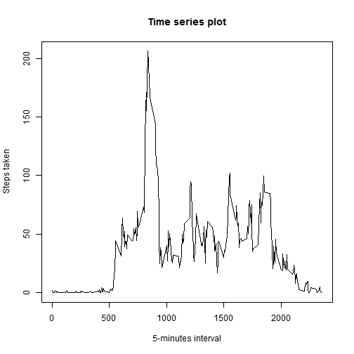
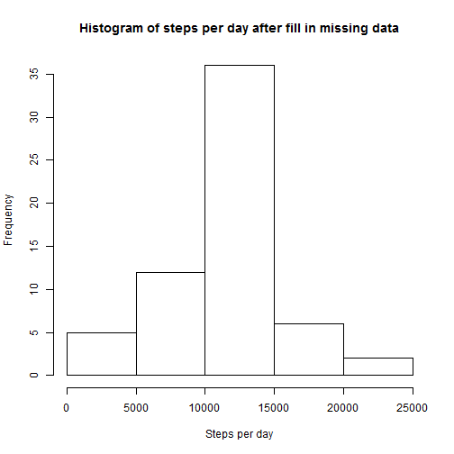
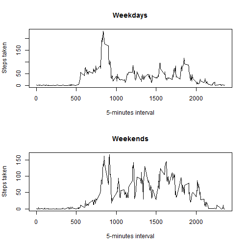

# Reproducible Research: Peer Assessment 1


## Loading and preprocessing the data

```r
originData <- read.csv("activity.csv")
Date <- strptime(originData$date, format = "%Y-%m-%d")
originData <- cbind(originData, Date)
```


## What is mean total number of steps taken per day?

```r
stepsPerDay <- tapply(originData$steps, originData$date, sum, na.rm = TRUE)
meanSteps <- mean(stepsPerDay, na.rm = TRUE)
medianSteps <- median(stepsPerDay, na.rm = TRUE)
hist(stepsPerDay, main = "Histogram of steps per day", xlab = "Steps per day")
```

 


The mean steps taken per day is **9354.2295** steps and the median is 
**10395** steps.


## What is the average daily activity pattern?


```r
stepsPerInterval <- tapply(originData$steps, originData$interval, mean, na.rm = TRUE)
plot(x = rownames(stepsPerInterval), y = stepsPerInterval, type = "l", xlab = "5-minutes interval", 
    ylab = "Steps taken", main = "Time series plot")
```

 

```r
maxSteps <- which.max(stepsPerInterval)
```

the 5-minute interval start at **835hrs**,on 
average across all the days in the dataset, contains the maximum number of steps.


## Imputing missing values

```r
totalNA <- sum(is.na(originData$steps))
```

There are **2304** NAs in the data.

The code below fill the average (rounded to integer) of the 5-minute interval 
of all days is filled into the missing data.This is based on assumption that the 
person have similar activity pattern each day. 


```r
fullData <- originData
for (i in row(fullData)) {
    if (is.na(fullData$steps[i])) {
        fullData$steps[i] <- round(stepsPerInterval[as.character(fullData$interval[i])])
    }
}
```


```r
stepsPerDay1 <- tapply(fullData$steps, fullData$date, sum)
meanSteps1 <- mean(stepsPerDay1)
medianSteps1 <- median(stepsPerDay1)
hist(stepsPerDay1, main = "Histogram of steps per day after fill in missing data", 
    xlab = "Steps per day")
```

 


After fill in missing data, the mean steps taken per day is **10765** 
steps and the median is **10762** steps. Compare to the 
previous mean and median of **9354.2295** steps and **10395** steps,
both values are increased. In previous case, all NAs are considered
as 0, thus the data is more right skewed. After imputing, the missing data is
filled with the average steps taken at the moment of all days. The NAs that are 
considered 0 become some value greater, thus the mean is increased.

## Are there differences in activity patterns between weekdays and weekends?

```r
weekDay <- weekdays(originData$Date, abbreviate = TRUE)
wdays = c("Mon", "Tue", "Wed", "Thu", "Fri")
wends = c("Sat", "Sun")
for (i in row(fullData)) {
    if (weekDay[i] %in% wends) 
        weekDay[i] <- "Weekends" else if (weekDay[i] %in% wdays) 
        weekDay[i] <- "Weekdays"
}
weekDay <- as.factor(weekDay)

fullData <- cbind(fullData, weekDay)

wkdData <- subset(fullData, fullData$weekDay == "Weekdays")
wkendData <- subset(fullData, fullData$weekDay == "Weekends")

wkdPattern <- tapply(wkdData$steps, wkdData$interval, mean)
wkendPattern <- tapply(wkendData$steps, wkendData$interval, mean)

par(mfrow = c(2, 1))
plot(x = rownames(wkdPattern), y = wkdPattern, type = "l", xlab = "5-minutes interval", 
    ylab = "Steps taken", main = "Weekdays")
plot(x = rownames(wkendPattern), y = wkendPattern, type = "l", xlab = "5-minutes interval", 
    ylab = "Steps taken", main = "Weekends")
```

 

```r

```

